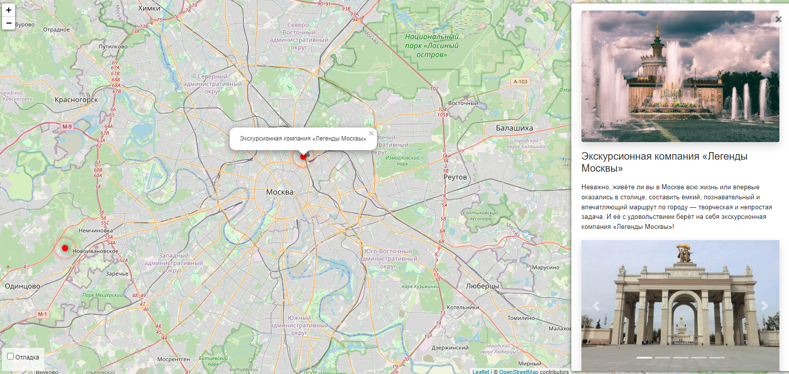

# Проект Туристическая карта

Это веб-приложение на базе Django для создания и отображения карты туристических мест с интерактивными элементами. Каждое место включает изображения, краткое и полное описание, позволяя пользователям исследовать достопримечательности и их детали.



## Возможности

- **Динамическое отображение карты**: Интеграция с Leaflet.js для интерактивной карты с кликабельными метками мест.
- **Управление изображениями**: Поддержка нескольких изображений для каждого места с возможностью задания порядка.
- **Форматирование текста**: Полные описания создаются с помощью WYSIWYG-редактора (`tinymce`) для удобного форматирования.
- **Данные GeoJSON**: Места и их метаданные отображаются в виде объектов GeoJSON для динамического рендеринга.
- **Боковая панель на Vue.js**: Панель для отображения подробной информации о выбранном месте.

---

## Установка

### Требования
- Python 3.7.7
- Django 3.2.25

### Переменные окружения
```SECRET_KEY``` - Хранит секретный ключ Django. Этот ключ используется для шифрования сессий, токенов и других операций. \
```DEBUG``` - Режим отладки. По умолчанию в коде установлено ```DEBUG=True``` \
```ALLOWED_HOSTS``` - Это список допустимых доменных имен или IP-адресов, с которых может быть доступен ваш сервер.
### Шаги

1. Клонируйте репозиторий:

2. Создайте виртуальное окружение:
   ```
   python -m venv .venv

3. Используйте его:
   ```
   .venv/Scripts/Activate
   
4. Установите зависимости Python:
    ```
    pip install -r requirements.txt

5. Выполните миграции БД
   ```
   python manage.py migrate

6. Создайте суперпользователя:
    ```
   python manage.py createsuperuser

7. Запустите сервер разработки:
    ```
   python manage.py runserver

8. Откройте приложение по адресу ```http://127.0.0.1:8000```

## Использование

### Добавление мест

#### Способ 1 (вручную, через админ-панель)
1. Перейдите в админ панель Django ```http://127.0.0.1:8000/admin```
2. Создайте новое место (Location), указав название, описание и координаты.
3. Добавьте связанные изображения (Images) и задайте их порядок.

#### Способ 2 (через команду ```load_places ```)
Данный метод позволяет выполнить загрузку нескольких JSON файлов.\

**Использование:**
   ```
   python manage.py load_place http://адрес/файла.json
   ```
**Функциональность:**
- Из каждого файла JSON извлекается информация о месте: название, описание, координаты и изображения.
- Информация сохраняется в базу данных:
- В случае успешной загрузки отображается сообщение об успешной обработке каждого места.

**Пример JSON-файла:**

```
{
    "title": "Пример места",
    "short_description": "Краткое описание места",
    "long_description": "Детальное описание места",
    "coordinates": {
        "lng": 37.6173,
        "lat": 55.7558
    },
    "imgs": [
        "https://example.com/image1.jpg",
        "https://example.com/image2.jpg"
    ]
}

```

### Просмотр карты
- Откройте главную страницу, чтобы исследовать интерактивную карту.
- Нажмите на метки на карте, чтобы увидеть подробности на боковой панели.


Наслаждайтесь созданием своей интерактивной туристической карты! 🎉
Пример сайта - https://amore1123.pythonanywhere.com/
